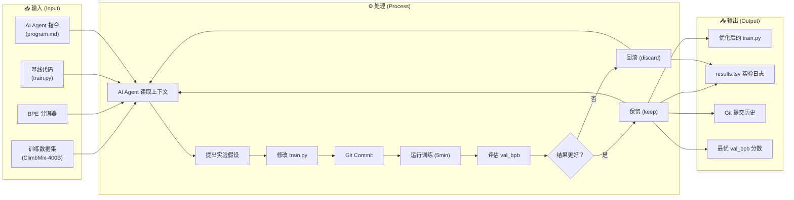
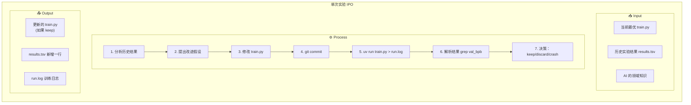
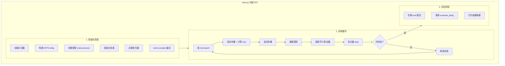

# 🔬 AutoResearch 方法论分析报告

> 让 AI Agent 成为全自动研究员——自主实验、自主迭代、自主进化

---

## 1. 项目背景

**AutoResearch** 是由 Andrej Karpathy（前 Tesla AI 总监、OpenAI 联合创始人）于 2026 年 3 月发布的开源项目。其核心理念极其大胆：

> **让 AI Agent 完全取代人类研究员，自主进行深度学习模型的调优实验。**

用户只需"睡一觉"，醒来后就能看到 AI 在夜间完成的约 100 次实验、不断优化的模型代码和详细的实验日志。

### 1.1 灵感来源

Karpathy 在 README 中写道：

> *"曾经，前沿 AI 研究是由肉身计算机在吃饭、睡觉、娱乐的间隙完成的……那个时代已经过去了。研究现在完全属于自主 AI Agent 集群的领域。"*

这反映了一个趋势：**AI 不仅是研究的对象，更应该成为研究的主体**。

---

## 2. 核心思想：三句话概括

1. **固定约束，放开探索**：固定训练时间（5 分钟）、固定数据集、固定评估指标，让 AI 在"规则之内"自由创新
2. **单文件迭代，Git 管理**：AI 只修改一个文件（`train.py`），每次实验 git commit，好结果保留、坏结果回滚
3. **永不停歇的实验循环**：AI Agent 无限循环地提出假设→修改代码→训练→评估→保留/丢弃，直到人类手动中断

---

## 3. 系统级 IPO（Input-Process-Output）



| 维度 | 详细说明 |
|------|---------|
| **Input** | ① 训练数据（预下载的 Parquet 分片）② 预训练的 BPE 分词器 ③ 初始 `train.py` 代码 ④ `program.md` Agent 指令 |
| **Process** | AI Agent 按照 `program.md` 的指令，循环执行"修改→提交→训练→评估→保留/回滚"流程 |
| **Output** | ① 不断优化的 `train.py` ② `results.tsv` 实验记录表 ③ Git 分支上的提交历史 ④ 最优的 val_bpb 分数 |

---

## 4. 架构解析：三个文件，各司其职

AutoResearch 的架构设计极为精妙，刻意保持极简：

### 4.1 文件职责矩阵

| 文件 | 角色 | 谁来修改 | 类比 |
|------|------|---------|------|
| `prepare.py` | 基础设施层 | ❌ 无人修改（只读） | 实验室的仪器设备 |
| `train.py` | 实验代码层 | 🤖 AI Agent 修改 | 研究员的实验方案 |
| `program.md` | 指令层 | 👤 人类修改 | 实验室主任下达的研究方向 |

### 4.2 各文件详解

#### `prepare.py` — 不可变的基础设施

```
职责：
├── 固定常量：MAX_SEQ_LEN=2048, TIME_BUDGET=300s, EVAL_TOKENS
├── 数据下载：从 HuggingFace 下载 Parquet 数据分片
├── 分词器训练：基于 rustbpe 训练 BPE 分词器
├── 数据加载器：make_dataloader() — BOS 对齐、Best-fit 打包
└── 评估函数：evaluate_bpb() — 固定的 Bits-Per-Byte 评估指标
```

> [!IMPORTANT]
> **`prepare.py` 是"裁判"**——它定义了公平的评估标准。如果 AI 能修改评估函数，就等于考试时改答案，实验就失去了意义。

#### `train.py` — AI 的"实验台"

```
可修改范围：
├── 模型架构：GPTConfig（层数、头数、维度、窗口模式）
├── 优化器配置：Muon + AdamW 的学习率、momentum、weight decay
├── 训练超参数：batch size、warmup/warmdown 比例
├── 模型大小：DEPTH、ASPECT_RATIO、HEAD_DIM
└── 训练循环：学习率调度、梯度累积步数等

当前基线架构：
├── 12 层 GPT（768 维，6 头）
├── MuonAdamW 自定义优化器
├── Sliding Window Attention（SSSL 模式）
├── Value Embedding（ResFormer 技术）
├── RoPE 旋转位置编码
└── Logit Softcapping（softcap=15）
```

#### `program.md` — 人类写的"研究指南"

这是 AutoResearch 最独特的设计。人类不直接写代码，而是写**指导 AI 如何做研究的文档**：

```
program.md 的内容结构：
├── Setup：如何初始化实验环境
├── Experimentation：实验规则（能做什么/不能做什么）
├── Output format：如何解读训练输出
├── Logging results：如何记录到 results.tsv
└── The experiment loop：永不停歇的循环流程
```

---

## 5. 实验循环的 IPO（单次实验）

每一次实验迭代本身也是一个完整的 IPO：



| 阶段 | 具体操作 |
|------|---------|
| **Input** | 当前最优代码 + 过往实验数据 + AI 内在知识 |
| **Process** | 产生假设→代码修改→git 提交→训练 5 分钟→提取 val_bpb→与最佳比较 |
| **Output** | 更好→保留代码，推进分支；更差/崩溃→回滚代码，记录原因 |

### 5.1 决策逻辑

```
val_bpb 更低（更好）→ status = "keep"，分支向前推进
val_bpb 持平或更高  → status = "discard"，git reset 回滚
训练崩溃（OOM/NaN）→ status = "crash"，回滚并分析原因
```

### 5.2 关键约束条件

| 约束 | 值 | 目的 |
|------|---|------|
| 时间预算 | 固定 5 分钟 | 公平比较不同配置 |
| 评估指标 | val_bpb (bits per byte) | 与词表大小无关，公平衡量 |
| 可修改范围 | 仅 `train.py` | 控制实验变量 |
| 包依赖 | 不可新增 | 避免引入不确定性 |

---

## 6. 代码模块级 IPO（`train.py` 内部）

`train.py` 内部的处理流程：



### 6.1 模型架构 IPO

| 组件 | Input | Process | Output |
|------|-------|---------|--------|
| **Embedding** | token_ids `[B,T]` | 查表 + RMS Norm | 嵌入向量 `[B,T,C]` |
| **Attention** | x, cos_sin, ve | QKV 投影 → RoPE → QK Norm → FA3 → 投影 | 注意力输出 `[B,T,C]` |
| **MLP** | x `[B,T,C]` | 线性扩展(4x) → ReluSquared → 线性压缩 | MLP 输出 `[B,T,C]` |
| **Block** | x, ve, cos_sin | RMS Norm → Attention + 残差 → RMS Norm → MLP + 残差 | 块输出 `[B,T,C]` |
| **GPT Forward** | idx, targets | 嵌入 → N×Block（带 resid/x0 lambda） → Norm → LM Head → Softcap | loss 或 logits |

### 6.2 优化器 IPO（MuonAdamW）

| 参数类型 | 优化器 | 关键超参数 |
|---------|--------|-----------|
| 矩阵参数（注意力权重、MLP权重） | **Muon**（极坐标正交化 + Nesterov 动量） | lr=0.04, momentum=0.95, ns_steps=5 |
| Embedding 参数 | **AdamW** | lr=0.6, betas=(0.8, 0.95) |
| Unembedding 参数（lm_head） | **AdamW** | lr=0.004 |
| 标量参数（resid_lambdas, x0_lambdas） | **AdamW** | lr=0.5 / 0.005 |

---

## 7. 关键设计哲学

### 7.1 "固定时间预算"的巧妙

传统超参数搜索按 epoch 或 step 来比较不同配置，但这忽略了一个问题：**不同的模型大小、batch size 在相同 step 下消耗的时间完全不同**。

AutoResearch 的做法：用**墙钟时间（wall clock time）**作为统一的约束。这带来两个优势：

1. **公平比较**：一个小模型跑 1000 步 vs 大模型跑 200 步，只要都是 5 分钟，就是公平的
2. **平台适配**：AutoResearch 会自动找到**当前硬件平台** 5 分钟内能达到的最优模型

### 7.2 "简约性原则"

> *"A 0.001 val_bpb improvement that adds 20 lines of hacky code? Probably not worth it."*
> *"An improvement of ~0 but much simpler code? Keep."*

这不仅仅是代码审美——简约的技术方案通常**泛化性更好、维护性更高**。

### 7.3 "永不停歇"

AI Agent 被明确指示：

> **"NEVER STOP"** — 一旦实验循环开始，不要暂停询问人类。人类可能在睡觉。

这是一个**范式转换**：从"人类指导 AI 做实验"变为"人类设定规则后，AI 完全自主运行"。

---

## 8. AutoResearch 的方法论总结

### 8.1 核心方法论框架

```
┌─────────────────────────────────────────────────────────────┐
│                    AutoResearch 方法论                        │
│                                                              │
│  1. 分离关注点                                                │
│     ├── 基础设施（prepare.py）：不变                           │
│     ├── 实验代码（train.py）：AI 迭代                          │
│     └── 研究指令（program.md）：人类设定                       │
│                                                              │
│  2. 固定约束条件                                              │
│     ├── 固定时间预算                                          │
│     ├── 固定评估指标                                          │
│     ├── 固定数据集                                            │
│     └── 固定可修改范围                                        │
│                                                              │
│  3. 贪心搜索策略                                              │
│     ├── 每次只修改一个方向（或少量方向）                        │
│     ├── 好于当前最优 → 保留                                   │
│     ├── 差于/等于当前最优 → 丢弃                               │
│     └── 类似"爬山算法"的局部搜索                              │
│                                                              │
│  4. 版本控制即实验管理                                        │
│     ├── Git commit = 实验快照                                 │
│     ├── Git branch = 实验线路                                 │
│     ├── Git reset = 实验回滚                                  │
│     └── results.tsv = 实验日志                                │
│                                                              │
│  5. 完全自主运行                                              │
│     ├── 无需人类干预                                          │
│     ├── ~12 实验/小时                                         │
│     ├── ~100 实验/一夜                                        │
│     └── 人类可随时中断查看结果                                │
└─────────────────────────────────────────────────────────────┘
```

### 8.2 与传统方法对比

| 维度 | 传统手动调参 | AutoML / HPO | **AutoResearch** |
|------|------------|-------------|-----------------|
| 搜索空间 | 人类预定义的超参数网格 | 人类预定义的搜索空间 | **AI 自主定义**（可改架构、优化器、任何代码） |
| 搜索策略 | 人类直觉 | 贝叶斯优化 / 随机搜索 | **AI 推理 + 领域知识** |
| 迭代速度 | 人类速度（几次/天） | 自动化但受限于预定义空间 | **~12 次/小时，完全自动** |
| 可修改维度 | 仅超参数 | 仅预定义搜索空间内的参数 | **代码级别的任意修改**（架构、优化器、初始化等） |
| 可解释性 | 高 | 低（黑盒搜索） | **高**（AI 写描述、Git diff 可审计） |

---

## 9. 适用场景与局限性

### ✅ 适合的场景

- 深度学习模型的**超参数调优和架构探索**
- 在**固定硬件和固定时间**约束下寻找最优配置
- 有**明确的单一数值指标**可以比较（如 val_bpb、accuracy、loss）
- 希望**无人值守**地运行大量实验

### ⚠️ 局限性

- **贪心搜索的局限**：可能陷入局部最优，错过需要"先变差再变好"的全局最优解
- **单指标优化**：不适合需要多目标权衡的场景（如 accuracy vs latency vs memory）
- **依赖 AI 的领域知识**：LLM 的知识截止日期之后的新技术可能不会被探索到
- **不适合超长训练**：5 分钟训练可能无法充分评估某些需要长时间训练才显现优势的技术

---

## 10. 教学价值总结

AutoResearch 作为一个教学案例，展示了以下重要思想：

1. **如何设计 AI Agent 的工作流程**：将复杂任务分解为"约束 + 循环 + 评估"
2. **如何让 AI 可控地探索**：通过"只读基础设施 + 可写实验代码"的分离
3. **如何管理实验**：Git + TSV 的轻量级实验追踪
4. **如何写好 AI 的"指令书"**：`program.md` 是 Prompt Engineering 在代码研究领域的精彩范例
5. **AI 辅助研究的范式**：从"人类做研究"到"人类设计研究框架，AI 执行研究"

> [!TIP]
> **核心启示**：AutoResearch 的精髓不在于代码本身，而在于**框架设计思想**——如何将一个开放的研究问题，转化为 AI Agent 可以自主执行的闭环流程。
